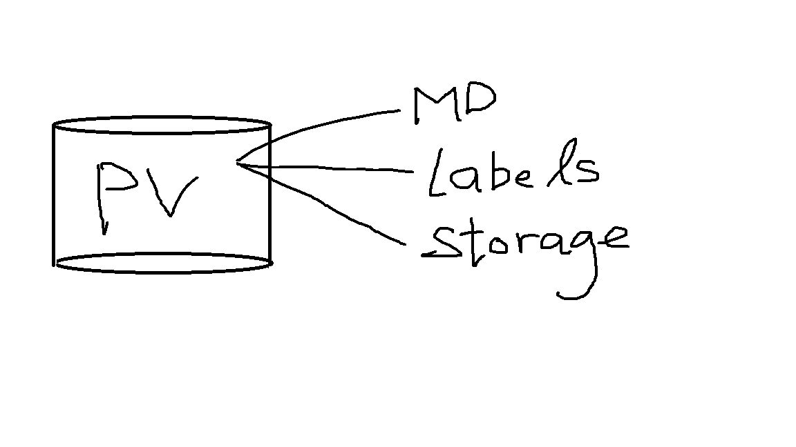
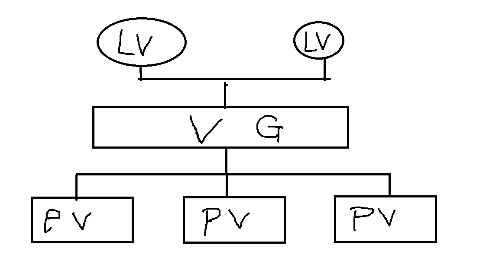

# What do i know about Linux storage
* [How to Determine if a disk is HDD or SSD](#how-to-determine-whether-a-disk-is-hdd-or-ssd-in-linux)
* [Partition, Format and Mount](#partition-format-and-mount)
* [Logical Volume Manager](#logical-volume-manager)

## How to Determine whether a disk is HDD or SSD in Linux
---
```bash
# rota stands for rotational device here
# output '0' -> SSD
# output '1' -> HDD
$ lsblk -o name,rota | tail
loop20         0
loop21         0
loop22         0
loop23         0
sda            1
├─sda1         1
└─sda2         1
nvme0n1        0
├─nvme0n1p1    0
└─nvme0n1p2    0
```
## Partition, Format and Mount
---
### Intro
* HDD must be partitioned before being used (at least 1 partition)
* Need to partition disk when
    - installing OS
    - setting up new drive

### Scenerio
- Hypervisor: Hyper-V
- Guest VM: Ubuntu
- Add a New Disk "sdb"

### Goal (Setting up new drive)
1. Partition the Raw block device
2. Format the Partition
3. Mount the FS

### Step
0. Check the Device
    ```bash
    $ sudo fdisk -l /dev/sdb
    Disk /dev/sdb: 127 GiB, 136365211648 bytes, 266338304 sectors
    Disk model: Virtual Disk
    Units: sectors of 1 * 512 = 512 bytes
    Sector size (logical/physical): 512 bytes / 4096 bytes
    I/O size (minimum/optimal): 4096 bytes / 4096 bytes
    ```

1. Define partition scheme
    ```bash
    $ sudo fdisk /dev/sdb
    Command (m for help): p

    ...
    Disklabel type: dos
    Disk identifier: 0x035bb2a7

    Command (m for help): g
    Created a new GPT disklabel (GUID: DB0A9709-45B4-E643-842B-4546317DEC66).

    Command (m for help): w
    The partition table has been altered.
    Calling ioctl() to re-read partition table.
    Syncing disks.

    $ # 'g' means creating a GPT partition scheme and 'w' stands for writing the table and exit
    ```

2. Check if the partition label added to /dev/sdb
    ```bash
    $ sudo fdisk -l /dev/sdb
    ...
    Disklabel type: gpt
    Disk identifier: DB0A9709-45B4-E643-842B-4546317DEC66
    ```

3. Create a New Partition
    ```bash
    $ sudo fisk /dev/sdb
    ...
    Command (m for help): n
    Partition number (1-128, default 1): 1
    First sector (2048-266338270, default 2048):
    Last sector, +/-sectors or +/-size{K,M,G,T,P} (2048-266338270, default 266338270):

    Created a new partition 1 of type 'Linux filesystem' and of size 127 GiB.

    Command (m for help): p
    Disk /dev/sdb: 127 GiB, 136365211648 bytes, 266338304 sectors
    Disk model: Virtual Disk
    Units: sectors of 1 * 512 = 512 bytes
    Sector size (logical/physical): 512 bytes / 4096 bytes
    I/O size (minimum/optimal): 4096 bytes / 4096 bytes
    Disklabel type: gpt
    Disk identifier: DB0A9709-45B4-E643-842B-4546317DEC66

    Device     Start       End   Sectors  Size Type
    /dev/sdb1   2048 266338270 266336223  127G Linux filesystem

    Command (m for help): w
    The partition table has been altered.
    Calling ioctl() to re-read partition table.
    Syncing disks.
    ```

4. Check if partition successful
    ```bash
    $ lsblk
    ...
    sdb                         8:16   0   127G  0 disk
    └─sdb1                      8:17   0   127G  0 part
    ```

5. Format the Partition
    ```bash
    $ # -t stands for Fs Type
    $ mkfs -t ext4 /dev/sdb1
    mke2fs 1.46.5 (30-Dec-2021)
    Discarding device blocks: done
    Creating filesystem with 33292027 4k blocks and 8323072 inodes
    Filesystem UUID: c15ae1c0-51d3-4815-a49f-c3a26b780831
    Superblock backups stored on blocks:
            32768, 98304, 163840, 229376, 294912, 819200, 884736, 1605632, 2654208,
            4096000, 7962624, 11239424, 20480000, 23887872

    Allocating group tables: done
    Writing inode tables: done
    Creating journal (131072 blocks): done
    Writing superblocks and filesystem accounting information: done
    ```

6. Mount the Partition
    ```bash
    $ sudo mkdir /opt/data
    $ sudo mount /dev/sdb1 /opt/data
    $ lsblk
    ...
    sdb                         8:16   0   127G  0 disk
    └─sdb1                      8:17   0   127G  0 part /opt/data
    ```

7. (Optional) Mount permanently: Edit the /etc/fstab
    ```bash
    $ sudo echo "/dev/sdb1 /opt/data ext4 defaults 0 0" >> /etc/fstab
    # FSTAB table structure
    # * Device - e.g. /dev/sdb1
    # * Mount Point - e.g. /opt/data
    # * File System Type - e.g. ext4
    # * Options (separate by commas if multiple)- e.g. defaults
    # * Backup operation: 1 = dump utility backup of a partition
    #                     0 = no backup
    # * File system chcek order: (fsck) 0 = no check
    #                                  >0 = check order
    #                                  root should be 1, other should be 2
    $ sudo mount -a
    ```

8. Remove partitions
    ```bash
    $ sudo umount /opt/data # unmount the partition
    $ lsblk
    ...
    sdb                         8:16   0   127G  0 disk
    └─sdb1                      8:17   0   127G  0 part  # the FS is gone
    $ sudo fdisk /dev/sdb # remove partition
    ...
    Command (m for help): d
    Selected partition 1
    Partition 1 has been deleted.

    Command (m for help): w
    The partition table has been altered.
    Calling ioctl() to re-read partition table.
    Syncing disks.
    $ lsblk
    sdb                         8:16   0   127G  0 disk  # no more partition
    ```

## Logical Volume Manager
---
### Features
* Flexible management of storage resource (create, resize, delete)
* better space utilization, combine multiple physical disk into a single logical volume
* mirroring and striping
* snapshotting on logical volume - create backups

### Comparison with [Traditional approach](#partition-format-and-mount)
* Limit flexibility: Once create partition, it is fixed in size and location. Cannot be easily resized or moved without deleting and recreating it.
* Waste of space: The size/capacity is bound by a single disk. Cannot pool disks together to form a bigger Volume group like LVM do.
* Limit redeundancy: If redundancy is needed, create multiple partition and use software like RAID which is comlex and not flexible as LVM do.

### Example
If there are 3 1TB drives
- Traditional approach: partition each 1TB drives individually. Cannot create partition with 2TB
- LVM approach: aggregate 3TB as a storage pool.

### Concepts

* Physical Volumes

    - Partition/whole disk designated for LVM use (single partition on disk is recommended)
    - Must be initialized as a physical volume
    - If whole device as PV, the disk must have no partition table
        ```bash
        # remove partition table using
        $ sudo wipefs -a <Physical-Volume>
        ```
    > Note: Recommended way is first create a single partition for the entire disk and then create the PV

    Layout
    
* Volume Groups


    logical grouping of PVs
    
* Logical Volume

    Types of Logical Volume
    - Linear Volumes
        - aggregate PV into one logical volume
        - more than one linear logical volume of whatever size can be created from VG
    - Striped logical volumes

        
    - RAID logical ovlumes
    - Thin-provisioned logical volumes
    - Snapshot volumes
    - Thin-provisioned snapshot volumes
    - Cache volumes

### Scenerio
- Hypervisor: Hyper-V
- Guest VM: Ubuntu
- Three Newly added device "sdb", "sdc" and "sdd"

### Steps

### Physical Volume
1. create Partition for each of the device using fdisk
    ```bash
    $ sudo lsblk
    ...
    sdb                         8:16   0   127G  0 disk
    sdc                         8:32   0   127G  0 disk
    sdd                         8:48   0   127G  0 disk

    $ # 1 partition for whole disk (may set GPT partition table)
    $ sudo fdisk /dev/sdb
    $ sudo fdisk /dev/sdc
    $ sudo fdisk /dev/sdd

    $ sudo fdisk -l
    Disk /dev/sdb: 127 GiB, 136365211648 bytes, 266338304 sectors
    ...
    Disklabel type: gpt
    Disk identifier: 06D71764-3363-7649-8954-7C07B9340FA4

    Device     Start       End   Sectors  Size Type
    /dev/sdb1   2048 266338270 266336223  127G Linux filesystem


    Disk /dev/sdc: 127 GiB, 136365211648 bytes, 266338304 sectors
    ...
    Disklabel type: gpt
    Disk identifier: 353A428E-B713-064F-AA24-40C90D2A4F43

    Device     Start       End   Sectors  Size Type
    /dev/sdc1   2048 266338270 266336223  127G Linux filesystem


    Disk /dev/sdd: 127 GiB, 136365211648 bytes, 266338304 sectors
    ...
    Disklabel type: gpt
    Disk identifier: AA58CBD3-FFDF-E44D-A0D4-3B40232CC527

    Device     Start       End   Sectors  Size Type
    /dev/sdd1   2048 266338270 266336223  127G Linux filesystem
    ```

2. Create Physical Volume for each of the 
    ```bash
    # This places a label on /dev/sdb1, /dev/sdc1, and /dev/sdc1, marking them as physical volumes belonging to LVM.
    $ sudo pvcreate /dev/sdb1 /dev/sdc1 /dev/sdd1
      Physical volume "/dev/sdb1" successfully created.
      Physical volume "/dev/sdc1" successfully created.
      Physical volume "/dev/sdd1" successfully created.

    # Diplay the PV by pvscan
    $ sudo pvscan
    ...
    PV /dev/sdb1                      lvm2 [<127.00 GiB]
    PV /dev/sdc1                      lvm2 [<127.00 GiB]
    PV /dev/sdd1                      lvm2 [<127.00 GiB]
    ...

    # Diplay the PV by pvs
    $ sudo pvs
    PV         VG        Fmt  Attr PSize    PFree
    ...
    /dev/sdb1            lvm2 ---  <127.00g <127.00g
    /dev/sdc1            lvm2 ---  <127.00g <127.00g
    /dev/sdd1            lvm2 ---  <127.00g <127.00g

    # Diplay the PV by pvdisplay
    $ sudo pvdisplay
    --- Physical volume ---

    ...
    "/dev/sdb1" is a new physical volume of "<127.00 GiB"
    --- NEW Physical volume ---
    PV Name               /dev/sdb1
    VG Name
    PV Size               <127.00 GiB
    Allocatable           NO
    PE Size               0
    Total PE              0
    Free PE               0
    Allocated PE          0
    PV UUID               ntCh9N-OrGI-BndX-0del-ySVE-D1p4-mWFIfg

    "/dev/sdc1" is a new physical volume of "<127.00 GiB"
    --- NEW Physical volume ---
    PV Name               /dev/sdc1
    VG Name
    PV Size               <127.00 GiB
    Allocatable           NO
    PE Size               0
    Total PE              0
    Free PE               0
    Allocated PE          0
    PV UUID               l1i1Zy-YYKr-KH7A-99rk-W0l5-xLSs-XmWGHG

    "/dev/sdd1" is a new physical volume of "<127.00 GiB"
    --- NEW Physical volume ---
    PV Name               /dev/sdd1
    VG Name
    PV Size               <127.00 GiB
    Allocatable           NO
    PE Size               0
    Total PE              0
    Free PE               0
    Allocated PE          0
    PV UUID               7v1dwW-cKhH-v3U5-Mufv-hc9d-XN4a-BD09d
    ```

### Volume Group
3. Create the LVM volume Group
    ```bash
    $ sudo vgcreate vg-1 /dev/sdb1 /dev/sdc1
      Volume group "vg-1" successfully created

    # view the volume group by vgs
    $ sudo vgs
    VG        #PV #LV #SN Attr   VSize    VFree
    ubuntu-vg   1   1   0 wz--n- <126.00g  63.00g
    vg-1        2   0   0 wz--n-  253.99g 253.99g
    
    # view the volume group by vgscan
    $ sudo vgscan
    Found volume group "vg-1" using metadata type lvm2
    Found volume group "ubuntu-vg" using metadata type lvm2

    # view the volume group by vgdisplay
    $ sudo vgdisplay
      --- Volume group ---
    VG Name               vg-1
    System ID
    Format                lvm2
    Metadata Areas        2
    Metadata Sequence No  1
    VG Access             read/write
    VG Status             resizable
    MAX LV                0
    Cur LV                0
    Open LV               0
    Max PV                0
    Cur PV                2
    Act PV                2
    VG Size               253.99 GiB
    PE Size               4.00 MiB
    Total PE              65022
    Alloc PE / Size       0 / 0
    Free  PE / Size       65022 / 253.99 GiB
    VG UUID               te5olQ-3kdM-sooq-MJ45-Pkea-hyFW-Tg1cAZ
    ...
    ```

    (Optional) Add PV to Volume Group
    ```bash
    # please replace <your-physical-volume>, In my case I will use /dev/sdd1
    $ sudo vgextend vg-1 /dev/<your-physical-volume>
    Volume group "vg-1" successfully extended
    ```

    (Optional) Rename group
    ```bash
    vgrename vg-1 vg-1000
    Volume group "vg-1" successfully renamed to "vg-1000"
    ```

    (Optional) Merge Volume group
    ```bash
    vgmerge -v <vgroup> <vgroupe>
    ```

    (Optional) Remove Empty Physical volumes by "vgreduce".
    ```bash
    # If the physical volume is still being used, migrate the data to another
    physical volume from the same volume group by:

    # 1. migrate the data to another physical volume
    $ sudo pvmove /dev/sdb1

    # 2. IF no enough free extents on the other physcial volumes in the exiting VG
    # then, create new PV from a new device
    $ sudo pvcreate /dev/sde1
    Physical volume "/dev/sde1" successfully created
    $ sudo vgextend vg-1 /dev/sde1
    Volume group "vg-1" successfully extended
    
    # 3. Move the data from sdb1 to sde1
    $ sudo pvmove /dev/sdb1 /dev/sde1
    ...

    # 4. Remove the physical volume
    $ sudo vgreduce vg-1 /dev/sdb1
      Removed "/dev/sdb1" from volume group "vg-1"
    ```

### Logical Volume
4. create logical volume using "vg-1"
    ```bash
    $ sudo lvcreate -L450 -n lv-1 vg-1
    Rounding up size to full physical extent 452.00 MiB
    Logical volume "lv-1" created

    $ sudo lvdisplay
    LV Path                /dev/vg-1/lv-1
    LV Name                lv-1
    VG Name                vg-1
    LV UUID                RWLba7-s8Jv-bBxn-qpdv-nj5Z-nFik-kMuxTT
    LV Write Access        read/write
    LV Creation host, time ubuntu2204.localdomain, 2023-05-22 10:26:53 +0000
    LV Status              available
    # open                 0
    LV Size                452.00 MiB
    Current LE             113
    Segments               1
    Allocation             inherit
    Read ahead sectors     auto
    - currently set to     256
    Block device           253:1
    ...

    # After mkfs and mount
    $ lsblk
    ...
    sdb                         8:16   0   127G  0 disk
    └─sdb1                      8:17   0   127G  0 part
    sdc                         8:32   0   127G  0 disk
    └─sdc1                      8:33   0   127G  0 part
    └─vg--1-lv--1           253:1    0   452M  0 lvm  /opt/data
    sdd                         8:48   0   127G  0 disk
    └─sdd1                      8:49   0   127G  0 part
    ...
    ```

## Reference
---
https://access.redhat.com/documentation/en-us/red_hat_enterprise_linux/4/html/cluster_logical_volume_manager/lv_overview